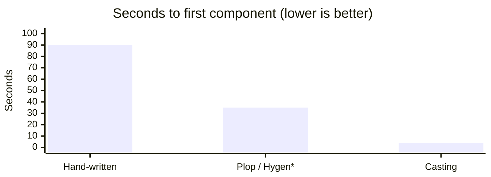
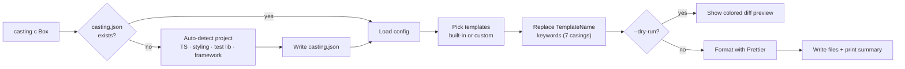

<div align="center">

# Casting

**Generate React components, hooks, and contexts in seconds — zero config, fully typed, auto-formatted.**

[](https://www.npmjs.com/package/casting-cli)
[](https://www.npmjs.com/package/casting-cli)
[](https://github.com/Aditya060806/Casting/actions/workflows/ci.yml)
[](https://nodejs.org)
[](https://github.com/Aditya060806/Casting/blob/main/LICENSE)

<br/>

*Stop hand-writing the same folder, component, style, and test files over and over.*
*Casting reads your stack and scaffolds files that already match your conventions.*

```bash
npx casting-cli component Box
```

</div>

---

## ⚡ 30-second demo

```console
$ npx casting-cli component Box

✓ Created 3 files in src/components/Box
  ├── ✓ Box.tsx
  ├── ✓ Box.module.css
  └── ✓ Box.test.tsx
```

That single command detected TypeScript + CSS Modules from your project, created the folder, and wrote a component, a scoped stylesheet, and a matching test — already formatted with your Prettier config.

## Why Casting?

- 🧠 **It reads your project, so you don't answer questions.** TypeScript? styled-components? Vitest? Next.js? Casting figures it out.
- ⚡ **One command, a whole feature.** Folder + component + style + test + barrel index, consistently named.
- 🧩 **More than components.** First-class generators for **hooks** and **contexts** too.
- 🎨 **Output looks hand-written.** Every file runs through your Prettier config.
- 🔍 **No surprises.** `--dry-run` shows a colored diff before touching disk.
- 🪶 **Tiny & fast.** ~23 kB install, no framework lock-in, runs on plain Node.

## Table of Contents

- [Features](#features)
- [How It Compares](#how-it-compares)
- [Efficiency](#efficiency)
- [How It Works](#how-it-works)
- [What Casting Detects](#what-casting-detects)
- [Quick Start](#quick-start)
- [Requirements](#requirements)
- [Config File](#config-file)
- [Commands](#commands)
- [Generate Components](#generate-components)
- [Generate Hooks](#generate-hooks)
- [Generate Contexts](#generate-contexts)
- [Interactive Mode](#interactive-mode)
- [Dry-Run Preview](#dry-run-preview)
- [Options](#options)
- [Custom Component Types](#custom-component-types)
- [Custom Templates](#custom-templates)
- [Template Keywords](#template-keywords)
- [Barrel / Index Files](#barrel--index-files)
- [Roadmap](#roadmap)
- [FAQ](#faq)
- [Contributing](#contributing)
- [License](#license)

## Features

| | Feature | What it means |
|---|---------|---------------|
| 🪄 | **Zero-config auto-detect** | Reads `package.json` + `tsconfig.json` to infer TypeScript, styled-components, CSS modules/preprocessor, test library, and framework. |
| ⚡ | **One-command scaffolding** | `casting c Box` creates the folder, component, style, test, and barrel file at once. |
| 🧩 | **Three generators** | Components, custom **hooks**, and **contexts** (Provider + typed consumer hook). |
| 🎨 | **Format on generate** | Output is piped through your project's Prettier config automatically. |
| 🔍 | **Dry-run diff preview** | See a colored, line-by-line preview before anything touches disk. |
| 🎛️ | **Interactive mode** | Run `casting` bare for an arrow-key menu. |
| 🧠 | **Typed config** | `casting.json` ships a JSON schema for editor autocomplete + validation. |
| 🧵 | **Next.js aware** | Adds the `'use client'` directive to contexts automatically. |
| 🧱 | **Custom templates & types** | Bring your own templates and define unlimited component types. |
| 🏷️ | **7 name casings** | `TemplateName`, `template-name`, `TEMPLATE_NAME`, and more — in files and content. |

## How It Compares

Casting focuses on doing common React scaffolding **out of the box**, without asking you to write template files first.

| Capability | **Casting** | generate-react-cli | Plop | Hygen | Hand-written |
|---|:---:|:---:|:---:|:---:|:---:|
| Works with **zero setup** | ✅ | ⚠️ config prompts | ❌ write templates | ❌ write templates | — |
| **Auto-detects** TS / styling / test lib | ✅ | ⚠️ manual answers | ❌ | ❌ | ❌ |
| Component generator | ✅ | ✅ | ✅¹ | ✅¹ | ✍️ |
| **Hook** generator | ✅ | ❌ | ✅¹ | ✅¹ | ✍️ |
| **Context** (Provider + hook) | ✅ | ❌ | ✅¹ | ✅¹ | ✍️ |
| Interactive menu | ✅ | ❌ | ✅ | ⚠️ | — |
| **Format on generate** (Prettier) | ✅ | ❌ | ❌ | ❌ | ✍️ |
| Dry-run **diff preview** | ✅ | ⚠️ paths only | ❌ | ❌ | — |
| Multiple names per command | ✅ | ✅ | ⚠️ | ⚠️ | ✍️ |
| Custom templates | ✅ | ✅ | ✅ | ✅ | — |
| Built-in **barrel/index** file | ✅ | ⚠️ template | ❌ | ❌ | ✍️ |
| Config **JSON schema** | ✅ | ❌ | ❌ | ❌ | — |
| Next.js `'use client'` awareness | ✅ | ❌ | ❌ | ❌ | ✍️ |

<sub>✅ built-in · ⚠️ partial / needs config · ❌ not supported · ✍️ do it yourself · ¹ generic scaffolders can do this only after you author template files.</sub>

## Efficiency

A typical **TypeScript component with a stylesheet, test, and barrel file** is 4 files and ~40 lines of boilerplate. Here is the shape of the savings (illustrative estimates for a component of this size — not audited benchmarks).

### Time to first working component



<sub>* Plop / Hygen require you to author template files first; the ~35s reflects usage once templates already exist.</sub>

### What you type vs. what you get

```text
You type:   casting c Box                       (15 characters)
You get:    Box.tsx  Box.module.css  Box.test.tsx  index.ts
            ~45 lines · formatted · consistently named   ──►  ≈300× leverage
```

### Savings at scale

| Components generated | Hand-written (~90s each) | Casting (~4s each) | Time saved |
|---|:---:|:---:|:---:|
| 10 | ~15 min | ~40 s | **~14 min** |
| 50 | ~75 min | ~3.5 min | **~71 min** |
| 200 | ~5 hrs | ~13 min | **~4.7 hrs** |

> Figures are illustrative to show the trend, not measured benchmarks — your mileage varies with file count and machine speed. The point stands: **one short command replaces dozens of keystrokes and naming decisions.**

## How It Works



Under the hood, every run is a small, predictable pipeline:

1. **Locate** — confirm you're at the project root (`package.json` present).
2. **Configure** — load `casting.json`, or create it by auto-detecting your stack on first run.
3. **Resolve templates** — use built-in templates, or your `customTemplates` overrides.
4. **Transform** — swap the `TemplateName` keyword family into your chosen name, in every casing.
5. **Format** — run the result through your project's Prettier (best-effort, skipped if absent).
6. **Emit** — write files (existing files are skipped, never overwritten) and print a summary.

## What Casting Detects

On first run (or `casting init --auto`), Casting maps your project's signals to config — no questions needed:

| Signal in your project | Casting sets |
|---|---|
| `tsconfig.json` or `typescript` dependency | `usesTypeScript: true` → `.tsx`/`.ts` output |
| `styled-components` dependency | `usesStyledComponents: true` |
| `sass` / `node-sass` | `cssPreprocessor: "scss"` |
| `less` | `cssPreprocessor: "less"` |
| `stylus` | `cssPreprocessor: "styl"` |
| `vitest` | `testLibrary: "Vitest"` |
| `@testing-library/react` | `testLibrary: "Testing Library"` |
| `next` | `framework: "next"` → contexts get `'use client'` |
| `vite` | `framework: "vite"` |

## Quick Start

```bash
# 1. Create config by auto-detecting your stack (one step, no questions)
npx casting-cli init --auto

# 2. Generate
npx casting-cli component Box
npx casting-cli hook useToggle
npx casting-cli context Theme

# ...or just run it and pick from a menu
npx casting-cli
```

Prefer a global install? The executable is `casting`:

```bash
npm i -g casting-cli
casting component Button
```

## Requirements

- Node.js **22** or higher
- npm **10** or higher

## Config File

On first run Casting **auto-detects** your project and pre-fills every answer, so setup is usually a single keypress. Create the config explicitly with:

```bash
casting init          # interactive, with detected defaults
casting init --auto   # non-interactive, uses detected values
```

Example `casting.json`:

```json
{
  "$schema": "https://raw.githubusercontent.com/Aditya060806/Casting/main/schema/casting.schema.json",
  "usesTypeScript": true,
  "usesCssModule": true,
  "cssPreprocessor": "scss",
  "testLibrary": "Testing Library",
  "component": {
    "default": {
      "path": "src/components",
      "withStyle": true,
      "withTest": true,
      "withStory": false,
      "withLazy": false,
      "withIndex": false
    }
  }
}
```

The `$schema` line unlocks autocomplete and validation for `casting.json` in editors like VS Code.

**Test library options**

| Option | Description |
|--------|-------------|
| `Testing Library` | [React Testing Library](https://testing-library.com/docs/react-testing-library/intro/) |
| `Vitest` | [Vitest](https://vitest.dev/) with React Testing Library |
| `None` | Basic test using React's `createRoot` API |

## Commands

| Command | Alias | Description |
|---------|-------|-------------|
| `casting component [names...]` | `c` | Generate one or more components |
| `casting hook [names...]` | `h` | Generate a custom hook (and test) |
| `casting context [names...]` | `ctx` | Generate a context (Provider + consumer hook) |
| `casting init` | | Create/overwrite `casting.json` (`--auto` to skip questions) |
| `casting` | | Interactive menu |

Every generator supports `--dry-run`, `--flat`, `-y, --yes`, and `-p, --path`.

## Generate Components

```sh
npx casting-cli component Box
```

```text
src/
└── components/
    └── Box/
        ├── Box.tsx
        ├── Box.module.css
        └── Box.test.tsx
```

Example output (`Box.tsx`, TypeScript + CSS Modules detected):

```tsx
import type { FC } from 'react';
import styles from './Box.module.css';

interface BoxProps {}

const Box: FC<BoxProps> = () => (
  <div className={styles.Box} data-testid="Box">
    Box Component
  </div>
);

export default Box;
```

Generate several at once:

```sh
npx casting-cli component Box Card Modal
```

## Generate Hooks

```sh
npx casting-cli hook useToggle
```

```text
src/
└── hooks/
    └── useToggle/
        ├── useToggle.ts
        └── useToggle.test.ts
```

```ts
// useToggle.ts
import { useCallback, useState } from 'react';

export function useToggle() {
  const [value, setValue] = useState<unknown>(null);
  const reset = useCallback(() => setValue(null), []);
  return { value, setValue, reset } as const;
}
```

Hooks default to `src/hooks`. Use `--path` to change it, or `--flat` to skip the folder.

## Generate Contexts

Generates a context, its `Provider`, and a typed consumer hook in one file.

```sh
npx casting-cli context Theme
```

```text
src/
└── context/
    └── ThemeContext/
        ├── ThemeContext.tsx
        └── ThemeContext.test.tsx
```

```tsx
// ThemeContext.tsx (abridged)
export function ThemeProvider({ children }: { children: ReactNode }) { /* ... */ }

export function useTheme() {
  const context = useContext(ThemeContext);
  if (context === undefined) {
    throw new Error('useTheme must be used within a ThemeProvider');
  }
  return context;
}
```

For React Server Components / Next.js, add the directive automatically:

```sh
npx casting-cli context Theme --client   # prepends 'use client'
```

Casting also adds `'use client'` on its own when it detects a Next.js project.

## Interactive Mode

Run Casting with no arguments to pick a generator, name it, and toggle files with arrow keys + spacebar:

```sh
npx casting-cli
```

```console
? Pick a generator › (Use arrow keys)
❯ Component
  Hook
  Context (Provider + hook)
```

## Dry-Run Preview

`--dry-run` prints a colored, diff-style preview of every file **without writing anything**:

```sh
npx casting-cli component Box --dry-run
```

```diff
ℹ Dry-run mode - no files were created

Would create in src/components/Box:
  ├── Box.tsx
  ├── Box.module.css
  └── Box.test.tsx

┌─ Box.tsx
│ + import type { FC } from 'react';
│ + import styles from './Box.module.css';
│ +
│ + const Box: FC = () => (
│ +   <div className={styles.Box} data-testid="Box">Box Component</div>
│ + );
│ +
│ + export default Box;
└─
```

## Options

Override any config rule on the command line:

```sh
npx casting-cli component Box --withTest=false
```

| Option | Description | Default |
|--------|-------------|---------|
| `-p, --path` | Output directory | Config value |
| `--type` | [Custom component type](#custom-component-types) | `default` |
| `--withLazy` | Generate a [lazy-loading](https://react.dev/reference/react/lazy) wrapper | Config value |
| `--withStory` | Generate a [Storybook](https://storybook.js.org) story | Config value |
| `--withStyle` | Generate a stylesheet | Config value |
| `--withTest` | Generate a test file | Config value |
| `--withIndex` | Generate a [barrel index file](#barrel--index-files) | Config value |
| `--dry-run` | Preview with a colored diff, write nothing | `false` |
| `-f, --flat` | Generate files directly in path (no folder) | `false` |
| `-y, --yes` | Skip prompts, use detected/config defaults | `false` |
| `--customDirectory` | Override the folder name ([details](#custom-component-types)) | Component name |

## Custom Component Types

Define named types with their own rules alongside `default`:

```json
{
  "component": {
    "default": { "path": "src/components", "withStyle": true, "withTest": true },
    "page":    { "path": "src/pages", "withLazy": true, "withStyle": true, "withTest": true },
    "layout":  { "path": "src/layout", "withTest": true }
  }
}
```

```sh
npx casting-cli component HomePage --type=page
npx casting-cli component Sidebar --type=layout
```

You can also override the generated folder name with `customDirectory` (must contain a template keyword):

```sh
npx casting-cli component Theme --type=provider --customDirectory=TemplateNameProvider
# → src/providers/ThemeProvider/ThemeProvider.tsx
```

## Custom Templates

Use your own templates instead of the built-ins by adding `customTemplates` to any component type:

```json
{
  "component": {
    "default": {
      "path": "src/components",
      "withStyle": true,
      "withTest": true,
      "customTemplates": {
        "component": "templates/TemplateName.tsx",
        "style": "templates/TemplateName.module.css",
        "test": "templates/TemplateName.test.tsx",
        "index": "templates/index.ts"
      }
    }
  }
}
```

All keys are optional — anything you omit falls back to Casting's built-in template.

## Template Keywords

Use these in template contents **and** filenames. Casting replaces each with your name in the matching case:

| Keyword | Format | Example (`user-card`) |
|---------|--------|-----------------------|
| `templatename` | raw (as typed) | `user-card` |
| `TemplateName` | PascalCase | `UserCard` |
| `templateName` | camelCase | `userCard` |
| `template-name` | kebab-case | `user-card` |
| `template_name` | snake_case | `user_card` |
| `TEMPLATE_NAME` | UPPER_SNAKE | `USER_CARD` |
| `TEMPLATENAME` | UPPERCASE | `USER-CARD` |

## Barrel / Index Files

Enable `withIndex` for a clean barrel export — **built in, no template required**:

```json
{ "component": { "default": { "withIndex": true } } }
```

```ts
// index.ts
export { default } from './Box';
```

Provide `customTemplates.index` to use your own barrel template.

## Roadmap

Ideas on the table (contributions welcome):

- Next.js `page.tsx` / `layout.tsx` generators
- State-slice generators (Zustand / Redux Toolkit)
- Auto-update of the parent barrel `index.ts` on generate
- A VS Code extension with right-click "Generate component"

## FAQ

**Does it overwrite existing files?**
No. Existing files are skipped and reported in the summary.

**What if I don't use Prettier?**
Formatting is best-effort. Without a local Prettier install, files are written as-is — nothing breaks.

**Can I use it in a JavaScript (non-TS) project?**
Yes. Casting detects the absence of TypeScript and emits `.js`/`.jsx`.

**Why is the package `casting-cli` but the command `casting`?**
The npm package is `casting-cli`; the installed executable is `casting`. Use `npx casting-cli …` or, after a global install, just `casting …`.

**Is my `casting.json` validated?**
Yes — the bundled JSON schema gives you autocomplete and inline validation in editors like VS Code.

## Contributing

```bash
git clone https://github.com/Aditya060806/Casting.git
cd Casting
npm install
npm test        # run the Vitest suite
npm run lint    # check style
```

Issues and PRs are welcome at [Aditya060806/Casting](https://github.com/Aditya060806/Casting).

## License

Casting is open source software [licensed as MIT](https://github.com/Aditya060806/Casting/blob/main/LICENSE), built by **Aditya Pandey**.
